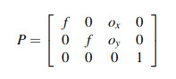
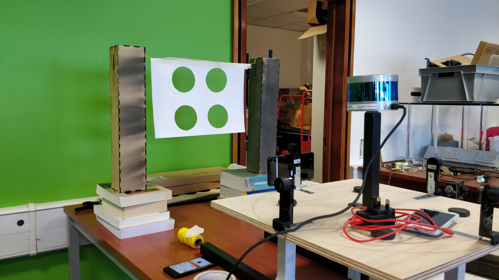
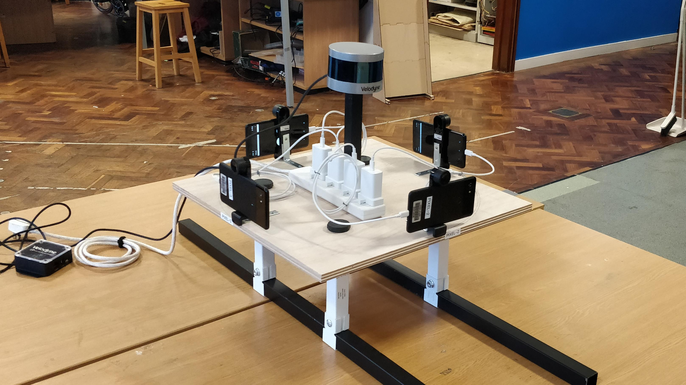

# Vehicle Visual and Distance Sensor Fusion and Real-time Processing

Supervisor: Soteris Demetriou

Author: [Belen Barbed](https://github.com/belenbarbed)

## Goal

The overarching goal of this project is to emulate the sensory functionality of a modern or autonomous vehicle using a legacy car and external hardware.

To achieve this, a car mount was built, which can collect visual and distance information, detecting objects around the vehicle as well as their angle and distance from it. It also displays the captured information in real-time.

The [full report](docs/Belen_Barbed_VVDSFRTP.pdf) goes into detail regarding the motivation, implementation, and evaluation of the system.

## Literature

[Introductory paper](http://seclab.illinois.edu/wp-content/uploads/2018/06/demetriou2018codrive.pdf)

[Callibration paper](https://pdfs.semanticscholar.org/ed15/5d1a146e0cba6be98fd7128461439f88732a.pdf)

  - [Implementation](https://github.com/robofit/but_velodyne/tree/master/but_calibration_camera_velodyne)

## First time setup

### Phones

The phones are running the app [hNode](https://play.google.com/store/apps/details?id=com.husarion.node&hl=en_GB), which establishes a network between them and the PC [(article)](https://medium.com/husarion-blog/dont-buy-expensive-sensors-for-your-robot-use-your-smartphone-24380eab521). After being registered on the same [network](https://app.husarnet.com/network/849), together with the PC, running ```rostopic list``` shows the topics the phones are publishing with their sensor data.

### PC (master node)

Add the PC to the Husarnet network using:
```
$ curl https://install.husarnet.com/install.sh | sudo bash
$ sudo husarnet websetup
```
Follow the link returned to configure your device.

Make sure the ```~/.bashrc``` or  ```~/.zshrc``` has the following lines to ensure ROS compiles and that the Husarion networks connects correctly:
```
source /opt/ros/melodic/setup.bash
source <ROS workspace dir>/devel/setup.sh

export ROS_IPV6=on
export ROS_MASTER_URI=http://master:11311
export ROS_HOSTNAME=master
```

After pulling this repo into the src of a catkin workspace, remember to also pull the git submodules present: ```velodyne``` and ```vision_opencv``` with:
```
$ git submodule update --init --recursive
```
It is recommended to remove the ```build/``` and ```devel/``` folders and build the workspace from scratch at the beginning, using:
```
$ catkin clean
$ catkin build
```

### Velodyne

Follow the [ROS integration instructions](http://wiki.ros.org/velodyne/Tutorials/Getting%20Started%20with%20the%20Velodyne%20VLP16). For IP adress configuration, check out [these slides](https://velodynelidar.com/docs/manuals/63-9266%20REV%20A%20WEBSERVER%20USER%20GUIDE,HDL-32E%20&%20VLP-16.pdf).

## Calibration

### Camera Calibration

To calibrate the phone cameras, we used the Matlab function [cameraCalibrator](https://uk.mathworks.com/help/vision/ref/cameramatrix.html), which uses a 8x6 chequer-board with 24mm-sized squares, photographed 40 times from different angles and perspectives. This result returns the focal length and the principal points of the matrix (f and ox and oy in the projection matrix below).



### Camera-to-LiDAR Calibration

The four phones can be calibrated against the LiDAR separately. To do so, run:
```
$ roslaunch but_calibration_camera_velodyne calibration_fine.launch pixel:="PIXEL_NO"
```
with ```PIXEL_NO``` being the phone one wants to calibrate (1-4). Please ensure the relevant phone is facing the marker (a card with four equidistant circles cut from it) before beginning the calibration process.



The results from this calibration are printed on the terminal output and should be saved in [but_calibration_camera_velodyne/conf/coloring.yaml](but_calibration_camera_velodyne/conf/coloring.yaml) in order to be used for the colouring node in the same package, executable with:
```
$ roslaunch but_calibration_camera_velodyne coloring.launch
```

For further camera-to-LiDAR calibration instructions, it is recommended to review the [paper that explains the theory](https://pdfs.semanticscholar.org/ed15/5d1a146e0cba6be98fd7128461439f88732a.pdf), as well as the [original package](https://github.com/robofit/but_velodyne/tree/master/but_calibration_camera_velodyne) that implemented it.

## Usage

On the PC, several commands should be run.

On the first tab, run:
```
$ roscore
```

Then, to make the Velodyne LiDAR start posting cloudpoint data, execute:
```
$ roslaunch velodyne_pointcloud VLP16_points.launch
```

After that, one can run
```
$ rosrun face_detection face_detection_py.py
```
to detect faces, or:
```
$ rosrun car_detection car_detection_py.py
```
to detect cars in all 4 camera streams, and display them all using:
```
$ rosrun visualization video_visualization
```

## Troubleshooting

If things are suddenly not working and one wants to start the build afresh, run:
```
$ cd <ROS workspace dir>
$ catkin clean
$ catkin build
```
Then remember to source in **ALL open** tabs:
```
source devel/setup.sh
```

If the phones and LiDAR don't sync properly, check their exact system time. If it's not the same, down to the second, one may have sync issues. For reference, check out [this atomic clock website](time.is) to match their system times.

Other useful troubleshooting guides:
  - [Using cvBridge with python3](https://stackoverflow.com/questions/49221565/unable-to-use-cv-bridge-with-ros-kinetic-and-python3)
  - [cv2+numpy import problems](https://stackoverflow.com/questions/20518632/importerror-numpy-core-multiarray-failed-to-import)
  - [no module named em](https://answers.ros.org/question/257757/importerror-no-module-named-em-error/)

## Project Sections

### Equipment
  - Lidar: Velodyne VLP-16 + mount
    - [Product page](https://velodynelidar.com/vlp-16-lite.html)
    - [User manual](https://velodynelidar.com/docs/manuals/63-9243%20REV%20D%20MANUAL,USERS,VLP-16.pdf)
    - [ROS integration instructions](http://wiki.ros.org/velodyne/Tutorials/Getting%20Started%20with%20the%20Velodyne%20VLP16)
  - 4 Google Pixel 2 XL + phone mounts
  - Mount to vehicle
    - Circular & symmetric base
    - Aluminium extrusions to hold to car
    - Metal stand-offs to support base (4) and LiDAR (1)
    - 4 holes for phone mounts



### ROS
  - [```but_calibration_camera_velodyne```](https://github.com/robofit/but_velodyne/tree/master/but_calibration_camera_velodyne): node to callibrate the coordinate systems of the Lidar and 4 cameras.
  - ```car_detection```: uses OpenCV's cascade classifiers with [andrewssobral's trained classifier](https://github.com/andrewssobral/vehicle_detection_haarcascades/) to detect cars on all incoming camera streams. It then passes the locations of the found cars to the ```visualization``` pkg to visualise.
  - ```face_detection```: uses [ageitgey's OpenCV implementation](https://github.com/ageitgey/face_recognition) to detect all faces in each frame, to then relay that information in another message for the ```visualization``` pkg to display.
  - ```phone_streams```: listens to compressed image data from phones, uncompresses it, and publishes the raw image in new topic.
  - [hNode](https://play.google.com/store/apps/details?id=com.husarion.node&hl=en_GB): ROS node running in each of the phones to publish all phone sensor data (incl cameras) as ROS topics.
  - [```velodyne```](https://github.com/ros-drivers/velodyne): driver for the VLP16, publishes the 3D cloudpoints over ethernet to ```/velodyne_points```.
  - [```vision_opencv```](https://github.com/ros-perception/vision_opencv.git): contains cv_bridge to use with python3 nodes.
  - ```visualization```: performs sensor fusion with the detected objects from ```car_detection``` or ```face_detection``` and visualises the resulting feeds using OpenCV.

### Object Recognition System
  - Car detection: in ```car_detection``` package using OpenCV's cascade classifiers with [andrewssobral's trained classifier](https://github.com/andrewssobral/vehicle_detection_haarcascades/).
  - Face detection: in ```face_detection``` package using [ageitgey's OpenCV implementation](https://github.com/ageitgey/face_recognition).

### Visualisation

Is currently in ```visualization``` pkg, using [cv2](https://opencv.org/).
